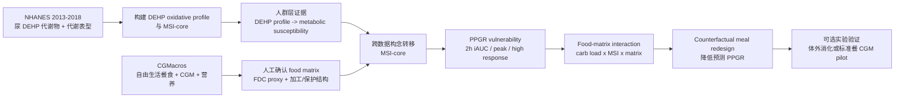

# Nature Food 目标稿：NHANES + CGMacros 后续实验设计与执行规划

生成日期：2026-06-17

## 目标定位

目标期刊：`Nature Food`

Nature Food 关注食物生产、加工、流通、消费与人群和地球健康之间的跨学科证据。因此，本稿不能写成单纯的“DEHP 与代谢异常”环境流行病学论文，也不能写成普通 PPGR 预测论文。最强的 Nature Food 叙事应是：

> 食物接触/加工相关塑化剂暴露所标记的代谢易感性，是否定义了一类面对特定食物基质和餐食负荷时更易出现餐后血糖脆弱性的个体；并且能否用食物基质重构降低这种风险。

## 推荐题目

英文工作题目：

**Plasticizer-related metabolic susceptibility and food-matrix-dependent postprandial glycemic vulnerability in U.S. adults and free-living CGM meal records**

中文工作题目：

**塑化剂相关代谢易感性与食物基质依赖的餐后血糖脆弱性：NHANES 与 CGMacros 的跨数据集三角验证研究**

## 中心假设

1. 在 NHANES 中，DEHP 氧化代谢谱与胰岛素抵抗和糖脂代谢易感性相关。
2. 在 CGMacros 中，同一代谢易感性构念可识别更高餐后血糖反应和 high-response meal 风险。
3. 食物基质、碳水负荷、纤维/蛋白/脂肪保护结构和加工代理指标会调节这种 PPGR 脆弱性。
4. 基于食物基质的餐食重构可在模型层面降低预测 PPGR；若补做实验，可在体外消化或小型标准餐 CGM pilot 中验证方向。

## 稿件边界

### 主文保留

- NHANES 2013-2018：DEHP 氧化代谢谱与 MSI-core、HOMA-IR、HbA1c、TyG、TG/HDL-C。
- CGMacros：MSI-core 与 PPGR、high-response meal、餐食负荷/食物基质交互。
- Food matrix：人工复核后的餐食基质分类、FDC 营养特征、加工/保护性结构代理变量。
- Prediction/translation：MSI-aware PPGR risk stratification、few-shot personalization、counterfactual meal redesign。
- 机制补充：MEHP/DEHP 相关 PPAR、氧化应激、胰岛素信号、脂质代谢转录组/数据库证据。

### 主文不放或只放补充

- JAEB 血糖相图；建议作为第二篇独立论文。
- NHANES linked mortality。
- 大而全的机制网络图。
- 未经人工确认的食物图像标签。
- 过多模型排行榜。

## 研究设计总览

## Aim 1：NHANES 人群暴露锚点

### 目的

证明 DEHP 氧化代谢谱与代谢易感性相关，并且这种关系不仅是总暴露量驱动。

### 数据

- 主数据：`D:\NHANES_MetS_Project\output\NHANES_2013_2018_master_analysis.csv`
- 关键结果：`D:\NHANES_MetS_Project\result\DEHP_summary_continuous_models_2013_2018.csv`
- MSI 数据：`D:\ShiYiSiNan_CGMacros\outputs\integrated_mainline\high_impact_computational_upgrade_2026-06-11\01_nhanes_dual_msi_dataset.csv`

### 暴露

Primary:

- `ln(Sigma DEHP)`
- `%Oxidative metabolites per 10 percentage points`
- `ln((MEHHP + MEOHP + MECPP) / MEHP)`
- `ILR oxidative-vs-primary balance`

Secondary:

- MEHP、MEHHP、MEOHP、MECPP 单体。
- Raw four-monomer mixture index。

### 结局

Primary:

- MSI-core
- ln(HOMA-IR)
- HbA1c

Secondary:

- TyG
- ln(TG/HDL-C)
- obesity / central obesity / metabolic syndrome

### 必须补强的分析

1. 用 R `survey` 重跑最终模型，保留复杂抽样设计。
2. 固定协变量集：age、sex、race/ethnicity、education、PIR、energy intake、smoking、alcohol、physical activity、urinary creatinine、cycle。
3. LOD、肌酐、尿稀释、糖尿病诊断/用药排除敏感性。
4. 周期复制：2013-2014、2015-2016、2017-2018 分周期方向一致性。
5. 暴露组成模型：总 DEHP 调整后检验 oxidative-vs-primary balance。

### 成功标准

- `%Oxidative` 或 oxidative/MEHP 与 MSI-core、ln(HOMA-IR) 方向稳定。
- 至少一个 glycemic marker 和一个 lipid-insulin marker 支持方向一致。
- 敏感性分析不出现系统性反向。

## Aim 2：CGMacros 食物基质与 PPGR 脆弱性

### 目的

证明 NHANES 中的代谢易感性构念在自由生活餐食 CGM 数据中对应更高 PPGR，并评估食物基质是否决定脆弱性表达。

### 数据

- 主餐食表：`D:\ShiYiSiNan_CGMacros\outputs\integrated_mainline\high_impact_computational_upgrade_2026-06-11\01_cgmacros_dual_msi_meal_dataset.csv`
- Stage 3 报告：`D:\ShiYiSiNan_CGMacros\outputs\integrated_mainline\stage3_cgmacros_msi_ppgr\stage3_cgmacros_msi_ppgr_report_2026-06-10.md`
- Stage 4 报告：`D:\ShiYiSiNan_CGMacros\outputs\integrated_mainline\stage4_prediction_personalization\stage4_prediction_personalization_report_2026-06-10.md`

### 结局

Primary:

- 2h iAUC
- 2h peak delta
- high-response meal by subject-aware or cohort threshold

Secondary:

- time-to-peak
- 3h iAUC
- late excursion / recovery proxy
- curve cluster, if CGM curve reconstruction available

### 主要预测变量

- MSI-core
- carbs_10g
- glycemic load proxy
- fiber-to-carb ratio
- protein/fat protective matrix
- meal timing
- pre-meal glucose
- food matrix category
- processing proxy
- liquid vs solid
- refined starch/sugar dominated vs intact/whole-food matrix

### Food matrix 人工标注方案

#### 标注对象

优先标注所有需要 `manual_review` 的餐食，当前估计约 932 餐。

#### 标注维度

每餐至少给出：

1. dominant carbohydrate matrix：refined grain / whole grain / starchy vegetable / fruit / sugar-sweetened / mixed / none。
2. physical form：liquid / semi-solid / solid / mixed。
3. processing level proxy：minimally processed / processed / ultra-processed-like / unclear。
4. protective matrix：high fiber / high protein / high fat / mixed protective / none。
5. visible portion confidence：high / medium / low。
6. FDC match confidence：confirmed / plausible / poor / not matchable。
7. reviewer note。

#### 标注质量控制

- 双人独立标注至少 20%-30% 餐食。
- 计算 agreement 和 Cohen kappa。
- 冲突由第三轮 adjudication。
- 主分析只使用 high/medium confidence 标签；low confidence 放敏感性分析。

### 模型

Primary mixed model:

`PPGR ~ carbs_10g + MSI-core + food_matrix + carbs_10g:MSI-core + carbs_10g:food_matrix + MSI-core:food_matrix + premeal_glucose + meal_hour + total_energy + (1 | subject)`

若 Python 环境实现困难，可用：

- subject-cluster robust linear model
- subject fixed effects sensitivity
- leave-subject-out prediction

### 成功标准

- MSI-core 与 2h iAUC / peak delta / high-response risk 稳定正相关。
- 至少一个 food matrix 维度显示 PPGR 风险差异。
- 食物基质重构能降低 predicted high-response risk 或 predicted iAUC。

## Aim 3：MSI-aware PPGR 预测与餐食重构

### 目的

把关联证据转化为 Nature Food 更关心的应用问题：能否用代谢易感性和食物基质信息指导更低风险餐食设计。

### 模型阶梯

- M1：macronutrients + meal timing。
- M2：M1 + pre-meal glucose/activity/context。
- M3：M2 + MSI-core。
- M4：M3 + food matrix annotation。
- M5：M4 + few-shot subject-specific recalibration。

### 验证策略

- Primary：leave-one-subject-out。
- Secondary：within-subject temporal split。
- Few-shot：0/1/3/5/10-shot recalibration。

### 指标

Regression:

- MAE
- RMSE
- R2
- Pearson/Spearman correlation
- calibration slope/intercept by predicted decile

Classification:

- AUROC
- AUPRC
- Brier score
- calibration
- decision curve / net benefit

### Counterfactual meal redesign

对每餐生成 3-5 个可解释替代方案：

1. cap refined carbs at 45g or 60g。
2. replace refined starch with whole-food carbohydrate matrix。
3. add fiber +5g while preserving energy where possible。
4. shift 20g carbohydrate energy to protein/fat protective matrix。
5. reduce liquid sugar component。

输出：

- predicted iAUC delta
- predicted peak delta
- high-response risk delta
- subgroup effect by MSI tertile
- plausibility flags

## Aim 4：可选但强烈建议的实验验证

Nature Food 若要冲得更高，仅有跨数据库计算证据偏弱。建议至少补一个小型验证模块。

### 方案 A：体外消化实验

#### 目的

验证模型推荐的低风险重构餐是否降低 early glucose release。

#### 样本

选择 12-16 个餐食原型：

- high-risk refined/liquid/low-fiber matrix 4 个。
- matched redesigned meal 4 个。
- mixed matrix control 4 个。
- optional culturally relevant meal prototypes 4 个。

#### 实验设计

- INFOGEST static digestion 或可用的体外消化方案。
- 每个原型至少 triplicate。
- 时间点：0, 15, 30, 60, 90, 120 min。
- 终点：glucose release AUC、early 30-min release、starch digestibility proxy。

#### 成功标准

- redesigned meals 的 early glucose release 方向性下降。
- 与模型预测的 PPGR delta 方向一致。

### 方案 B：小型标准餐 CGM pilot

#### 目的

补齐同受试者内证据链。

#### 样本

- n=30-50 成人。
- 至少 10-14 天 CGM。
- 尿样检测 DEHP metabolites，最好 2-3 次 morning spot urine。
- 基线 HbA1c、fasting glucose、insulin、lipids、BMI、waist。

#### 餐食

每人完成 2-4 对标准餐：

- high-risk meal vs matrix-redesigned matched meal。
- 尽量等能量，差异集中在 food matrix / refined carb / fiber-protein structure。

#### 终点

- 2h iAUC
- peak delta
- time-to-peak
- late recovery
- high-response probability

#### 成功标准

- 高 oxidative DEHP / 高 MSI 个体对 high-risk meal 的 PPGR 更高。
- matrix-redesigned meal 降低 PPGR，且高 MSI 个体收益更明显。

#### 现实判断

如果没有 pilot，稿件仍可投 AJCN/Clinical Nutrition/Environment International；若目标 Nature Food，pilot 或体外消化会显著提高说服力。

## 主图设计

### Figure 1

研究设计和证据链：

- NHANES exposure -> MSI。
- CGMacros meals -> PPGR。
- Food matrix annotation。
- Counterfactual redesign / validation。

### Figure 2

NHANES 人群锚点：

- DEHP total vs oxidative profile。
- MSI-core、HOMA-IR、HbA1c、TyG、TG/HDL-C forest/heatmap。

### Figure 3

CGMacros MSI 与 PPGR：

- MSI tertile PPGR distribution。
- Mixed model effect estimates。
- High-response risk by MSI and carb load。

### Figure 4

Food matrix：

- Food matrix taxonomy。
- PPGR by matrix and MSI。
- carb load x matrix x MSI response surface。

### Figure 5

Prediction and personalization：

- Model ladder performance。
- Calibration by MSI。
- Few-shot personalization gain。

### Figure 6

Meal redesign / validation：

- Predicted PPGR reduction。
- In vitro glucose release or pilot CGM curves if available。
- High MSI subgroup benefit。

## 投稿前必须完成的 P0 清单

1. NHANES final survey-weighted models in R。
2. DEHP exposure construction audit：LOD、creatinine、cycle-specific weights、metabolite units。
3. CGMacros food matrix manual annotation and adjudication。
4. FDC proxy confirmation for all main-analysis meals。
5. Mixed/fixed-effects PPGR models with subject-level uncertainty。
6. Leave-subject-out prediction re-run in a locked environment。
7. Counterfactual meal redesign with plausibility constraints。
8. Methods and protocol deposit draft。
9. Data dictionary and source-data table for every figure。
10. STROBE + TRIPOD-AI style checklist if prediction model remains central。

## 8 周执行计划

### Week 1：冻结研究问题和数据

- 锁定主假设、primary exposure、primary outcome。
- 整理 NHANES 和 CGMacros 变量字典。
- 生成样本流图草稿。
- 建立统一输出目录：`D:\ai for science\nature_food_nhanes_cgmacros\`。

### Week 2：NHANES 最终复核

- R survey 重跑主模型。
- 周期复制。
- LOD/creatinine/diabetes medication sensitivity。
- 输出 Figure 2 source data。

### Week 3：食物基质人工标注

- 生成标注模板。
- 完成第一轮人工标注。
- 计算 agreement。
- 完成 adjudication。

### Week 4：CGMacros 主模型

- 重跑 PPGR mixed/fixed model。
- 加入 food matrix。
- 做 subgroup by MSI tertile。
- 输出 Figure 3-4 source data。

### Week 5：预测与个体化

- 重跑 model ladder。
- leave-subject-out 和 temporal split。
- few-shot recalibration。
- 输出 Figure 5 source data。

### Week 6：餐食重构

- 定义 counterfactual constraints。
- 输出 redesigned meal scenarios。
- 选择 12-16 个实验原型。
- 输出 Figure 6 计算版本。

### Week 7：实验验证或协议

- 若可做体外消化：完成实验 SOP、样本采购和试运行。
- 若暂不可做：完成注册级 protocol 和 feasibility appendix。
- 整理机制补充证据。

### Week 8：Nature Food 初稿

- 完成主文结构。
- 主图 1-6。
- Extended Data 和 Supplementary Tables。
- Cover letter：强调 food matrix、human health、cross-disciplinary food-system relevance。

## 预期风险和应对

| 风险 | 影响 | 应对 |
|---|---|---|
| NHANES 是横断面 | 不能因果化 | 写成 exposure-related susceptibility marker；用敏感性和机制三角验证 |
| NHANES 与 CGMacros 非同一受试者 | Nature Food 审稿风险大 | 用 MSI-core 作为跨数据构念；最好补同受试者 pilot |
| 食物基质自动标签可信度不足 | 主结论不稳 | 人工标注 + FDC confirmation + low-confidence sensitivity |
| CGMacros subject n=40 | 泛化弱 | leave-subject-out、bootstrap、外部 CGM补充只作边界验证 |
| 交互项不显著 | 主张减弱 | 把主线从 interaction 改为 risk stratification + matrix-dependent redesign |
| DEHP 来源不一定来自食物 | Nature Food 适配风险 | 使用 source-oriented proxies，避免声称食物是唯一暴露来源 |

## Go / No-Go 标准

### 可以冲 Nature Food

- NHANES oxidative profile 结果稳定。
- CGMacros MSI 与 PPGR 稳定。
- 食物基质人工标注完成且有可解释 matrix effect。
- 餐食重构显示高 MSI 人群预测收益。
- 至少有体外消化或标准餐 pilot 的初步方向性验证。

### 更适合 AJCN / Clinical Nutrition / Environment International

- NHANES 和 CGMacros 主结果稳定。
- 食物基质标注完成。
- 但没有同受试者 pilot 或实验验证。

### 应暂缓投稿

- 食物基质标注后 matrix effect 消失。
- MSI 与 PPGR 在 subject-level sensitivity 中不稳定。
- NHANES survey 复核后 oxidative profile 结果明显减弱或反向。

## 最终建议

以 Nature Food 为目标，下一步不是再增加更多公共数据，而是完成三个关键闭环：

1. NHANES 暴露-代谢易感性复核闭环。
2. CGMacros 食物基质-PPGR 人工确认闭环。
3. 餐食重构-体外消化或小型 CGM pilot 验证闭环。

只有这三个闭环完成，稿件才会从“聪明的跨数据库整合”升级为 Nature Food 更容易接受的“食物基质、环境暴露和人类代谢健康的可转化证据”。
