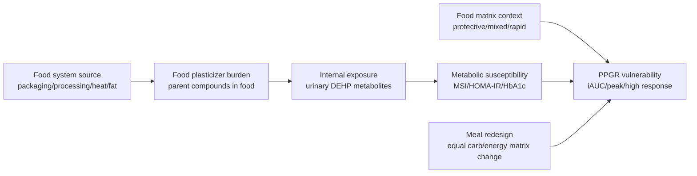

# 食品系统暴露链条图

```mermaid
flowchart LR
  N1["Food system source<br/>packaging/processing/heat/fat"] --> N2["Food plasticizer burden<br/>parent compounds in food"]
  N2 --> N3["Internal exposure<br/>urinary DEHP metabolites"]
  N3 --> N4["Metabolic susceptibility<br/>MSI/HOMA-IR/HbA1c"]
  N5["Food matrix context<br/>protective/mixed/rapid"] --> N6["PPGR vulnerability<br/>iAUC/peak/high response"]
  N4 --> N6
  N7["Meal redesign<br/>equal carb/energy matrix change"] --> N6
```
