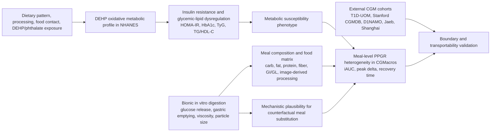

# CGMacros 与 NHANES-DEHP 项目深度整合研究方案

日期：2026-06-10  
项目 1：`C:\Users\liu12\OneDrive\Desktop\ShiYiSiNan_CGMacros`  
项目 2：`C:\Users\liu12\OneDrive\Desktop\NHANES_MetS_Project`

## 一、核心判断

这两个项目可以整合成一项更高水平的研究，但整合方式不能是简单把两个数据表横向拼接。CGMacros 没有 DEHP/phthalate 暴露数据，NHANES 没有连续血糖监测和餐食级 PPGR 曲线。因此，最有学术竞争力、也最经得住审稿的设计应是：

> 以 NHANES 建立“环境塑化剂暴露-胰岛素抵抗/糖脂代谢紊乱”的人群级证据，以 CGMacros 和外部 CGM 数据集建立“代谢易感性-餐后动态血糖反应”的个体级证据，再用体外仿生消化系统验证食物结构、消化释放和食品接触/加工情境的机制桥梁。

也就是说，这不是一篇普通的“DEHP + PPGR”拼盘，而是一篇多尺度精准营养与环境代谢健康研究：

- NHANES 解释慢性环境暴露如何塑造胰岛素抵抗和糖脂代谢易感性。
- CGMacros 解释这种代谢易感性如何表现为真实生活餐食后的动态血糖反应。
- 外部 CGM 数据集验证模型边界和人群迁移性。
- 体外仿生消化实验验证食物矩阵、糖释放动力学和食品接触/加工情境是否能解释高风险餐。

## 二、建议主论文定位

### 英文工作题目

Environmental metabolic susceptibility and postprandial glycemic dynamics: multiscale triangulation using NHANES, CGM-based nutrition cohorts, and bionic digestion experiments

### 中文工作题目

环境代谢易感性与餐后动态血糖反应：基于 NHANES、连续血糖营养队列和仿生消化实验的多尺度三角验证研究

### 论文主问题

慢性塑化剂暴露相关的胰岛素抵抗/糖脂代谢易感性，是否能解释真实生活餐食后的高餐后血糖反应风险？食物结构和消化释放动力学能否作为连接环境暴露、饮食结构和餐后血糖的机制桥梁？

### 最重要的科学假说

1. NHANES 中，DEHP 氧化代谢谱比单纯总 DEHP 暴露更稳定地关联 HOMA-IR、HbA1c、TyG 和 TG/HDL-C，提示一种环境暴露相关的代谢易感表型。
2. CGMacros 中，具有更高代谢风险表型的人群在同等餐食负荷下表现出更高的 PPGR、更差的模型校准或更强的少样本个体化需求。
3. 高 PPGR 餐不只由碳水含量决定，还受到食物结构、加工/包装情境、脂肪/纤维/蛋白组合和消化释放动力学影响。
4. 体外仿生消化实验可验证模型推荐的低风险膳食替换是否降低早期葡萄糖释放峰值、释放 iAUC 或模拟胃排空驱动的快速吸收。

## 三、两个项目已有证据基础

### 3.1 CGMacros 项目

已读关键文件：

- `README.md`
- `outputs/tables/meal_level_dataset.csv`
- `outputs/tables/clean_baseline_model_results.csv`
- `outputs/tables/clean_personalization_results.csv`
- `outputs/tables/calibration_main_summary.csv`
- `outputs/tables/counterfactual_main_summary.csv`
- `outputs/research_plan/high_impact_dry_plus_bionic_digestion_research_plan_2026-06-10.md`
- `outputs/dataset_search/external_database_acquisition_and_integration_plan_2026-06-10.md`
- `scripts/02_build_meal_level_dataset.py`

现有基础：

- 40 名受试者，约 1498 餐自由生活餐食。
- meal-level 表包含 86 个字段，包括餐食时间、热量、碳水、蛋白、脂肪、纤维、摄入比例、进餐前血糖、心率、活动、2h/3h AUC、iAUC、peak delta、time-to-peak、临床特征和部分肠道健康/微生物组特征。
- 现有模型已完成 leave-subject-out、within-subject temporal split、少样本个体化、校准诊断、反事实餐食替换和外部数据下载。
- 10-shot personalization 对 iAUC 预测有明显改进：例如 hist-gradient boosting 从 0-shot MAE 约 1915.9 降至 10-shot MAE 约 1553.9 mg/dL*min。
- 校准分析显示模型对极端反应存在压缩，正好为“代谢易感性/机制特征补充”提供切入点。
- 反事实分析显示限制碳水、碳水替换为蛋白、增加纤维等策略可降低模型预测 PPGR，但需要机制验证。

必须修正的问题：

- `subgroup_glycemic_status` 实际看起来是 race/ethnicity，而不是 glycemic status。整合研究前必须重新生成真正的 glycemic status 分层，例如 HbA1c `<5.7`, `5.7-6.4`, `>=6.5` 和 fasting glucose `<100`, `100-125`, `>=126`。

### 3.2 NHANES-DEHP 项目

已读关键文件：

- `research_strategy_plan_DEHP_metabolic_profile.md`
- `output/NHANES_2013_2018_master_analysis.csv`
- `output/NHANES_2013_2018_master_analysis_DEHPderived.csv`
- `result/DEHP_summary_continuous_models_2013_2018.csv`
- `result/DEHP_summary_logistic_models_2013_2018.csv`
- `result/metabolic_markers_TyG_TGHDL_linear_results_2013_2018.csv`
- `result/logratio_compositional_linear_results_2013_2018.csv`
- `result/DEHP_evidence_synthesis_matrix.csv`
- `code/07_merge_construct_dataset_2013_2018.R`
- `code/16_create_DEHP_summary_variables_2013_2018.R`
- `code/44_logratio_compositional_analysis_2013_2018.R`
- `code/54_mechanism_network_and_evidence_synthesis.R`

现有基础：

- NHANES 2013-2018 主分析样本 n=5267。
- DEHP derived 数据包含 131 个字段。
- HOMA-IR、HbA1c、TyG、TG/HDL-C、肥胖、中心性肥胖、代谢综合征均已构建。
- 已构建 DEHP molar burden、%oxidative、oxidative/MEHP ratio、log-ratio、ILR 等变量。
- 已完成主模型、剂量反应、组成暴露、混合暴露、敏感性分析、负控、E-value、死亡扩展和机制数据库综合。

关键结果：

- ln(Sigma DEHP) 与 ln(HOMA-IR) 正相关，约 +11.27%。
- %Oxidative 每升高 10 个百分点，ln(HOMA-IR) 约 +23.47%。
- oxidative/MEHP log-ratio 与 ln(HOMA-IR) 约 +24.08%。
- %Oxidative 与 HbA1c、TyG、ln(TG/HDL-C) 均呈方向一致的正相关。
- 对二分类结局，%Oxidative 与肥胖、中心性肥胖、代谢综合征均强相关。
- 机制证据指向 PPAR/nuclear receptor、oxidative stress、inflammation、insulin/glucose signaling、lipid metabolism、mitochondrial/ER stress。

必须修正的问题：

- 多个 R 脚本存在旧硬编码路径，例如 `C:/Users/liu12/Documents/Downloads/NHANES_MetS_Project`，投稿前需统一改为项目相对路径。
- BKMR、WQS 和 survey-qgcomp-like 模型需要谨慎命名，避免过度声明。
- 死亡分析样本量下降和 cause-specific failure 需单独审计，不建议放入联合论文主结果。

## 四、整合后的概念框架

核心逻辑是慢性环境暴露与急性餐后反应的连接：

- DEHP 氧化代谢谱不是直接放进 CGMacros 模型，而是作为 NHANES 中可验证的人群级代谢易感证据。
- CGMacros 用于验证这种代谢易感性是否表现为更强 PPGR、更差校准、更高个体化收益。
- 体外消化实验用于解释为什么某些食物或替换策略会改变 PPGR。

## 五、建议的高水平论文结构

### Aim 1：NHANES 中构建环境代谢易感性证据

目的：建立 DEHP oxidative metabolic profile 与 insulin resistance/glycemic-lipid dysregulation 的稳健人群级证据。

分析任务：

1. 冻结 primary exposures：
   - ln(Sigma DEHP)
   - %Oxidative per 10 percentage points
   - ln(Oxidative/MEHP)
   - ILR oxidative-vs-primary balance
2. 冻结 primary outcomes：
   - ln(HOMA-IR)
   - HbA1c
3. Secondary outcomes：
   - TyG
   - ln(TG/HDL-C)
   - obesity / central obesity / metabolic syndrome
4. 使用 survey-weighted GLM、quartile dose-response、RCS、composition/log-ratio、mixture sensitivity。
5. 使用 IPW/MI、LOD/creatinine、diabetes medication exclusion、negative control、permutation、E-value 作为稳健性层。
6. 构建一个 NHANES-derived metabolic susceptibility score：
   - 版本 A：基于临床变量，不含 DEHP，用于迁移到 CGMacros。
   - 版本 B：基于 DEHP oxidative profile + 临床变量，仅在 NHANES 内用于解释暴露贡献。

输出：

- 一个“环境代谢易感性图谱”：DEHP profile -> HOMA-IR/HbA1c/TyG/TG-HDL。
- 一个可迁移的 clinical metabolic susceptibility score，用于 CGMacros 分层。

### Aim 2：CGMacros 中建立餐后动态血糖易感性表型

目的：把 CGMacros 从“预测模型项目”升级为“动态代谢表型项目”。

分析任务：

1. 重建真实 glycemic status：
   - HbA1c `<5.7`, `5.7-6.4`, `>=6.5`
   - fasting glucose `<100`, `100-125`, `>=126`
   - BMI `<25`, `25-29.9`, `>=30`
2. 构建 PPGR 表型：
   - iAUC 0-2h / 0-3h
   - peak delta
   - time-to-peak
   - recovery time
   - early iAUC 0-60 min
   - late iAUC 60-180 min
   - curve-shape clusters
3. 建立代谢易感性与 PPGR 的关联：
   - HbA1c、fasting glucose、BMI、TG/HDL 或可用临床指标与 PPGR 的关系。
   - NHANES-derived clinical metabolic susceptibility score 与 PPGR 的关系。
4. 重新训练模型：
   - carb-only
   - macro-only
   - macro + pre-CGM
   - macro + pre-CGM + clinical susceptibility
   - macro + pre-CGM + clinical susceptibility + microbiome/gut health
5. 分析少样本个体化是否在高易感人群中收益更大：
   - 0/1/3/5/10-shot
   - stratified MAE/R2/calibration slope
   - high-response AUC/AP
6. 校准与临床决策：
   - calibration intercept/slope
   - decile calibration
   - conformal prediction interval
   - decision curve analysis

输出：

- 代谢易感性是否放大餐后血糖反应。
- 哪些人更需要个体化建模。
- 哪些餐食特征在高易感人群中最危险。

### Aim 3：跨数据集验证模型边界和可迁移性

目的：避免文章只依赖两个主项目自身，增强外部可信度。

已下载可用外部数据：

- `data/external/T1D_UOM_2025`
- `data/external/Stanford_CGMDB`
- `data/external/D1NAMO_T1D_GlucoseFoodInsulin`
- `data/external/ShanghaiT1DM_T2DM`
- `data/external/Jaeb_CGMND_HealthyAdults_2017`
- `data/external/Jaeb_Nutrition_T1D_2015_2016`
- `data/external/OhioT1DM`

建议分工：

| 数据集 | 作用 |
|---|---|
| T1D-UOM | 有 meal macros + CGM + insulin + activity/sleep，做 T1D 外部 PPGR 验证 |
| Stanford CGMDB | 标准化食物挑战，做食物/mitigator 机制验证 |
| D1NAMO | 食物图片 + glucose + insulin，做图像/餐食描述外部 case study |
| ShanghaiT1DM/T2DM | 中国糖尿病 CGM phenotype 参考 |
| Jaeb healthy adults | 健康成人 CGM 正常波动参考 |
| Jaeb Nutrition | GI/GL/available carbohydrate 特征工程参考 |
| OhioT1DM | 已有 T1D 外部 sanity check |

关键原则：

- 不把所有数据混在一起做随机划分。
- 采用 leave-dataset-out validation。
- T1D/T2D 数据只作为 disease-state transportability，不作为同分布验证。
- Stanford CGMDB 作为 controlled challenge，不作为自由生活餐食验证。

### Aim 4：体外仿生消化系统机制验证

目的：用少量但关键的体外实验验证模型的机制可解释性。

#### 4.1 样本选择逻辑

从三个来源筛选餐食：

1. CGMacros 中高 PPGR 或模型误差大的真实餐。
2. NHANES source-oriented analysis 指向的高 DEHP 暴露来源相关饮食结构，例如高加工、外食、包装接触、较高脂肪或能量密度食物。
3. Stanford CGMDB 和 Jaeb Nutrition 中标准化食物/高低 GI/GL 食物。

优先餐食类型：

- 高 GL 精制碳水：白米饭、面条、白面包、甜饮。
- 高脂高碳水加工餐：汉堡/披萨/油炸主食类。
- 同等碳水但结构不同：完整谷物 vs 粉碎/糊化主食。
- 加纤维/蛋白替换餐：验证反事实策略。
- 冷却回生/抗性淀粉增强餐：验证食物结构改变。

#### 4.2 实验分组

第一轮建议 16 个餐食原型，每个 2 个版本，每组 3 个技术重复：

| 类别 | 原型数 | 版本 |
|---|---:|---|
| 精制高 GL 主食 | 4 | 原始 vs 高纤/抗性淀粉版本 |
| 高脂高碳水加工餐 | 4 | 原始 vs 降碳水/加蛋白版本 |
| 同碳水不同结构餐 | 4 | 完整颗粒/低加工 vs 粉碎/糊化 |
| 模型高误差餐 | 4 | 原始 vs 模型推荐替换 |

总计约 32 组，3 次技术重复后约 96 个实验单元。

#### 4.3 体外检测指标

消化释放：

- glucose release Cmax
- Tmax
- release iAUC 0-30 min, 0-60 min, 0-120 min
- early release slope
- half-release time
- simulated gastric emptying half-time

食物结构：

- 粒径分布
- 黏度/流变
- 淀粉糊化/回生或抗性淀粉指标
- 水分保持和凝胶结构

可选环境暴露指标：

- 如果平台具备 LC-MS/MS 或可合作检测，建议测定餐食/消化液中的 DEHP、MEHP 或相关 phthalate metabolites。
- 若进行食品接触材料实验，应使用严格空白对照、玻璃器皿阴性对照、标准品回收率和污染控制。
- 该模块应定位为“food-contact exposure plausibility”，不能过早声称人体暴露剂量效应。

#### 4.4 体外结果如何进入模型

将体外结果转为 meal prototype features：

- `release_Cmax`
- `release_Tmax`
- `release_iAUC_60`
- `release_iAUC_120`
- `early_release_slope`
- `gastric_emptying_half_time`
- `viscosity`
- `particle_size_D50`

模型比较：

- M0：macro-only
- M1：macro + pre-CGM
- M2：macro + pre-CGM + metabolic susceptibility
- M3：M2 + digestion-informed features

主要检验：

- M3 是否改善高 PPGR 餐识别。
- M3 是否改善同碳水餐的误差。
- 模型预测的反事实下降方向是否与体外 glucose release 下降方向一致。
- 体外特征是否解释 CGMacros 中“同等碳水但 PPGR 不同”的现象。

## 六、统计和机器学习方案

### 6.1 NHANES

主模型：

- survey-weighted linear/logistic regression
- NHANES cycle weights, strata, PSU
- covariates: age, sex, race/ethnicity, education, PIR, BMI, smoking, alcohol, activity, energy intake, cycle, urinary creatinine

稳健性：

- complete-case vs IPW vs MI
- LOD handling
- creatinine adjustment vs creatinine-standardized exposure
- diabetes medication/diagnosis exclusion
- negative control outcome
- permutation negative control
- E-value

预测补充：

- train older cycles, validate newer cycles
- Model A: demographics + lifestyle + diet
- Model B: Model A + ln(Sigma DEHP)
- Model C: Model B + oxidative profile
- report AUC, PR-AUC, Brier, calibration slope, decision curve

### 6.2 CGMacros

主模型：

- linear/ridge mixed-effects baseline
- random forest / HistGradientBoosting / LightGBM or XGBoost
- subject-level and temporal split
- nested tuning only within training data

个体化：

- 0/1/3/5/10-shot personalization
- global model + subject-specific calibration
- hierarchical Bayesian or mixed-effect random intercept/slope as interpretable sensitivity

报告指标：

- MAE, RMSE, R2, Pearson r
- high-response AUC/AP
- calibration intercept/slope
- prediction interval coverage
- subject-level bootstrap CI
- decision curve analysis

### 6.3 跨尺度整合

不建议做伪个体级因果合并。推荐使用三角验证：

1. NHANES：DEHP oxidative profile 与代谢易感性。
2. CGMacros：代谢易感性与 PPGR 动态。
3. 外部 CGM：PPGR 模型边界和疾病状态迁移。
4. 体外消化：食物结构/释放动力学机制。

可以构建 evidence synthesis matrix：

| 证据层 | 支持问题 |
|---|---|
| NHANES survey association | 慢性环境暴露是否关联代谢易感性 |
| NHANES temporal validation | 暴露-代谢关系是否可复现 |
| CGMacros PPGR modeling | 代谢易感性是否影响餐后动态 |
| External CGM validation | 模型是否跨疾病/人群仍有边界解释 |
| Bionic digestion | 餐食结构和释放动力学是否解释反事实策略 |
| Mechanism databases | PPAR/oxidative stress/inflammation/insulin signaling 是否提供生物合理性 |

## 七、推荐主图

Figure 1：多尺度研究设计图和 DAG。  
Figure 2：NHANES 中 DEHP oxidative profile 与 HOMA-IR/HbA1c/TyG/TG-HDL 的主结果热图/森林图。  
Figure 3：CGMacros 中代谢易感性分层的 PPGR 差异、模型性能和少样本个体化收益。  
Figure 4：外部 CGM 数据集 leave-dataset-out 验证和 domain shift 分析。  
Figure 5：体外仿生消化实验，展示不同餐食/替换策略的 glucose release kinetics。  
Figure 6：整合证据矩阵，明确哪些证据支持 association、prediction、mechanism、translation。

## 八、目标期刊定位

最高目标但需要体外实验和外部验证更完整：

- Nature Food
- Nature Metabolism
- Cell Metabolism
- The Lancet Planetary Health

更现实的高水平目标：

- Environmental Health Perspectives
- Environment International
- eBioMedicine
- American Journal of Clinical Nutrition
- Diabetes Care

如果最终以方法和数字健康为主：

- The Lancet Digital Health
- npj Digital Medicine
- Patterns

判断标准：

- 如果体外消化和食品接触/释放检测完成，优先冲 Nature Food / EHP / Environment International。
- 如果以 CGM 模型、个体化和外部验证为主，优先冲 npj Digital Medicine / Diabetes Care / AJCN。
- 如果 NHANES 机制证据最强但 CGM 部分仅作为补充，优先冲 EHP / Environment International。

## 九、执行路线

### 第 1-2 周：工程统一和变量字典

- 修正 CGMacros 的 glycemic status 标签问题。
- 为两个项目建立 unified variable dictionary。
- NHANES 脚本路径改为项目相对路径。
- 固定 NHANES primary exposure/outcome/covariate。
- 固定 CGMacros primary PPGR outcomes。

### 第 3-4 周：NHANES 环境代谢易感性模型

- 重跑主模型、composition、mixture、dose-response。
- 构建 NHANES-derived clinical metabolic susceptibility score。
- 生成可迁移到 CGMacros 的 score 版本。
- 输出 Figure 2 和 Table 1/2。

### 第 5-6 周：CGMacros PPGR 分层和个体化

- 重新生成 glycemic/BMI/metabolic risk 分层。
- 重跑模型、校准、few-shot、decision curve。
- 检验 high-susceptibility 组是否需要更多 personalization。
- 输出 Figure 3。

### 第 7-8 周：外部数据验证

- T1D-UOM 构建统一 PPGR 表。
- D1NAMO 构建 food image/description case study。
- Stanford CGMDB 构建标准食物响应曲线分析。
- Shanghai/Jaeb 构建 CGM phenotype 参考。
- 输出 Figure 4。

### 第 9-12 周：体外仿生消化实验准备

- 根据干实验结果选择 16 个餐食原型。
- 制定标准化配方和食品接触/包装情境控制。
- 预实验确定采样时间点和 glucose release 检测流程。
- 若可行，建立 phthalate contamination control 和 LC-MS/MS 检测协作。

### 第 13-16 周：体外实验与模型闭环

- 完成 digestion release kinetics。
- 将体外特征映射回 CGMacros meal prototype。
- 重跑 digestion-informed model。
- 完成 Figure 5 和 evidence matrix。

## 十、最关键的风险和解决方案

| 风险 | 解决方案 |
|---|---|
| CGMacros 没有 DEHP 暴露 | 不做个体级合并，采用三角验证和代谢易感性桥接 |
| NHANES 横断面反向因果 | 明确观察性研究；做 temporal validation、负控、E-value、敏感性分析 |
| 体外消化不能代表人体 PPGR | 定位为食物释放机制验证，不声称完全复现人体血糖 |
| 外部 CGM 数据多为 T1D/T2D | 定位为疾病状态迁移和边界验证 |
| 模型可能过拟合 | subject-level split、leave-dataset-out、nested tuning、bootstrap CI |
| 多模块论文发散 | 主线只保留“环境代谢易感性 -> 餐后动态血糖 -> 消化机制” |

## 十一、报告规范

建议投稿前同时准备：

- STROBE-ME：环境/分子流行病学和生物标志物报告。
- STROBE-nut：营养流行病学饮食变量报告。
- TRIPOD+AI：预测模型报告。
- PROBAST+AI：预测模型偏倚风险评估。
- ARRIVE/体外实验质量控制清单可作为内部质控参考，但主文重点应描述随机化、重复、空白对照和检测限。

## 十二、结论

这两个项目整合后的最高水平版本，不是“NHANES 发现 DEHP 与代谢病相关，CGMacros 又做了 PPGR 预测”这样的并列叙述，而是一个更强的跨尺度命题：

> 慢性环境塑化剂暴露相关的代谢易感性，可在人群层面表现为胰岛素抵抗和糖脂紊乱，在个体层面表现为餐后动态血糖反应的异质性；食物结构、加工/食品接触情境和消化释放动力学构成连接环境暴露、饮食行为和餐后代谢风险的机制桥梁。

如果按这个框架推进，文章会同时具备环境健康、精准营养、CGM 数字表型、预测模型、体外机制验证五个层次，具备冲击更高水平期刊的潜力。

## 十三、关键来源

- CGMacros Scientific Data / Nature portfolio: https://www.nature.com/articles/s41597-025-05851-7
- CGMacros PhysioNet: https://physionet.org/content/cgmacros/
- Personalized Nutrition by Prediction of Glycemic Responses, Cell 2015: https://pubmed.ncbi.nlm.nih.gov/26590418/
- PREDICT 1, Nature Medicine 2020: https://pubmed.ncbi.nlm.nih.gov/32528151/
- ZOE / personalized nutrition intervention, Nature Medicine 2024: https://www.nature.com/articles/s41591-024-02951-6
- STROBE-ME: https://www.equator-network.org/reporting-guidelines/strobe-me/
- TRIPOD+AI / PROBAST+AI: https://www.tripod-statement.org/
- NHANES laboratory and environmental chemical data: https://wwwn.cdc.gov/nchs/nhanes/
- Stanford CGMDB: https://cgmdb.stanford.edu/data/
- T1D-UOM dataset: https://doi.org/10.5281/zenodo.15806142
- ShanghaiT1DM/T2DM dataset: https://doi.org/10.6084/m9.figshare.21600933.v5
